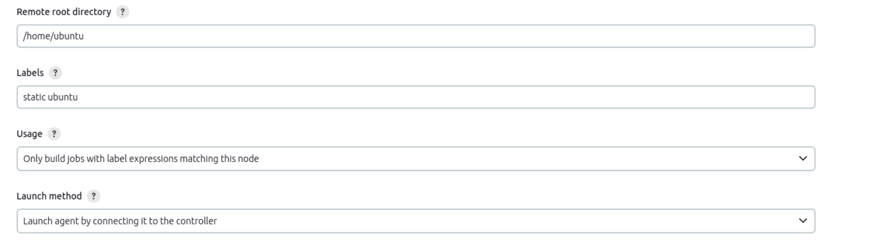
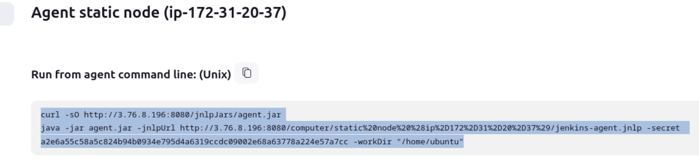
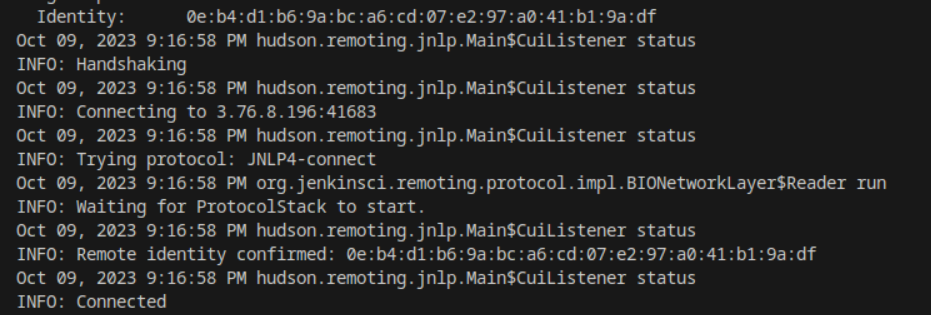
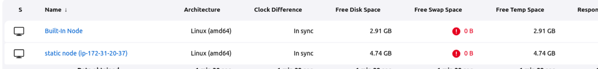
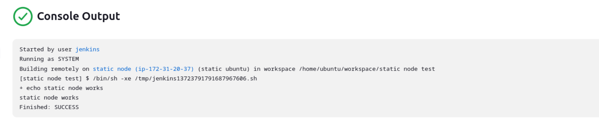
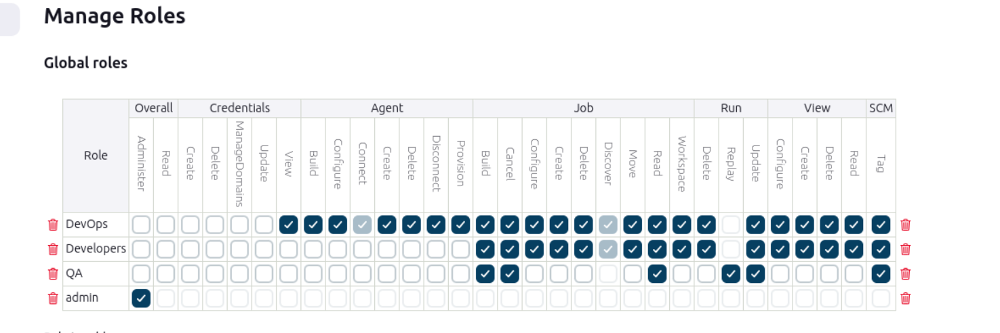
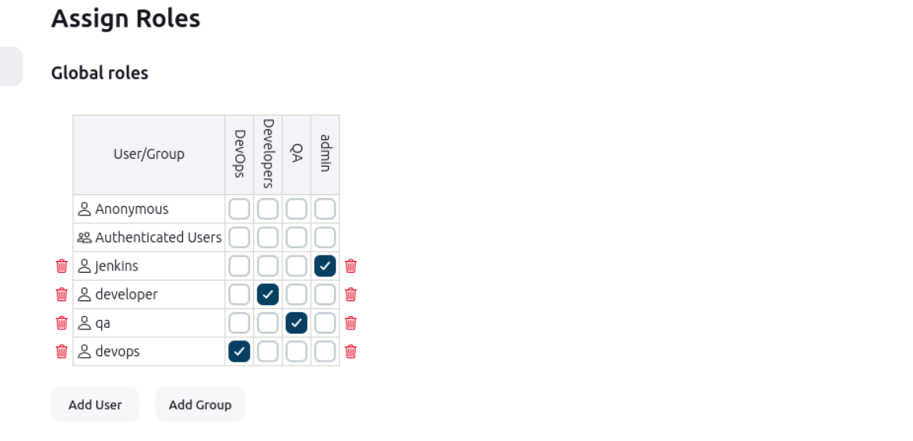

## Part 1
### 1. Configure static and dynamic agents
### Static agent
On static agent machine java JDK should be installed.
Statis node configurations in jenkins
  

Launch slave agents via Java Web Start on slave's machine
  

Node connected
  
  

Job launched successfully via static node
  

### 2. Use credentials for sensitive data (github/gitlab connactions etc.)

...

### 3. Access rights configuration. Create 3 groups (dev, qa, devops and grant them different rights)

[Role-based Authorization Strategy plugin](https://plugins.jenkins.io/role-strategy/) has been used for access rights configuration

Roles created and configured on "Manage role" screen (manage/role-strategy/)
  

Users associated with certain roles on Assign Roles page (manage/role-strategy/assign-roles)
  

## Part 2

some changes