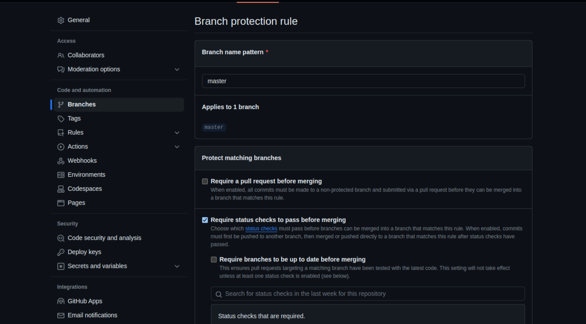
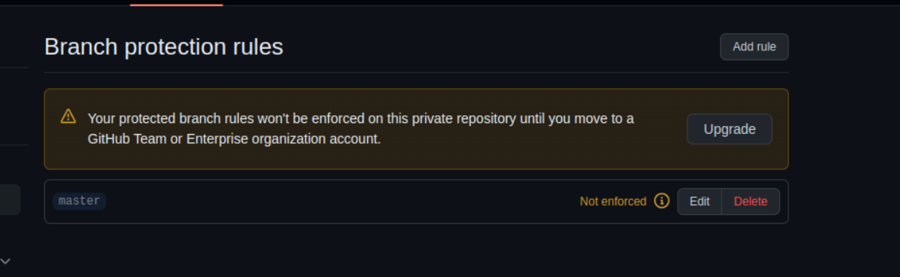
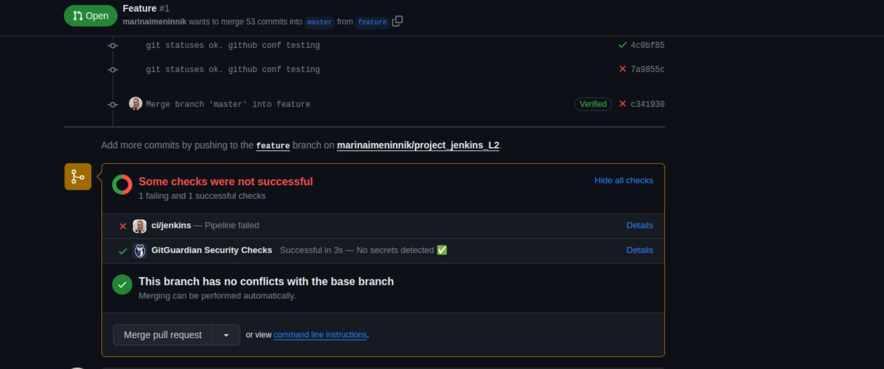
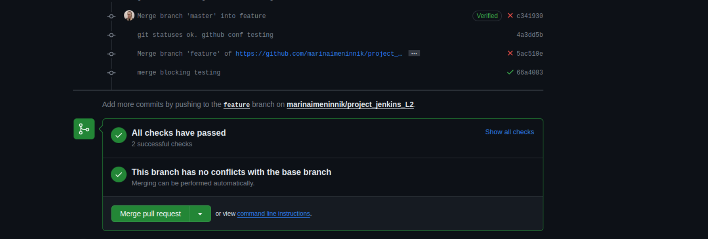
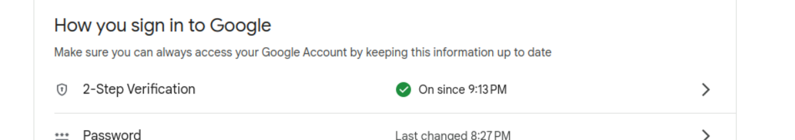
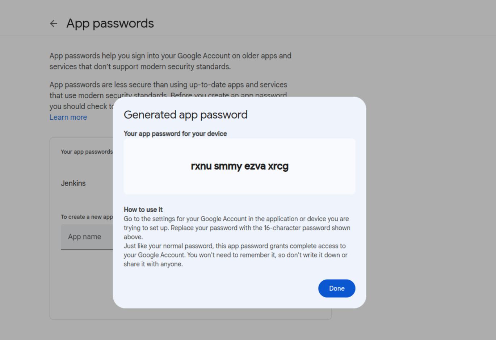
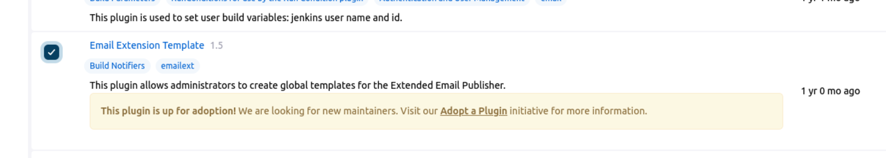
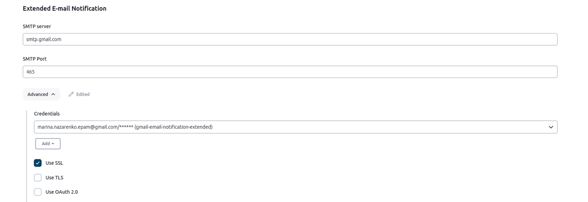
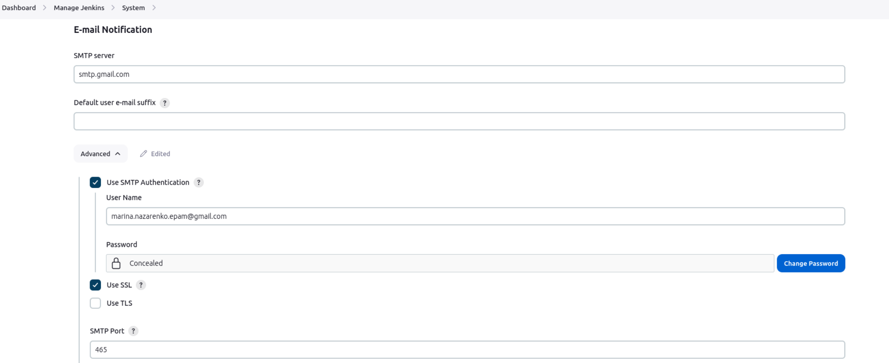
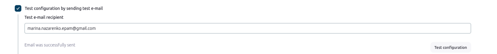

## Part 1
### 1. Configure static and dynamic agents
### Static agent
On static agent machine java JDK should be installed.
Statis node configurations in jenkins
<br></br>

Launch slave agents via Java Web Start on slave's machine
<br></br>

Node connected
<br></br>
<br></br>

Job launched successfully via static node
<br></br>

### 2. Use credentials for sensitive data (github/gitlab connactions etc.)

...

### 3. Access rights configuration. Create 3 groups (dev, qa, devops and grant them different rights)

[Role-based Authorization Strategy plugin](https://plugins.jenkins.io/role-strategy/) has been used for access rights configuration

Roles created and configured on "Manage role" screen (manage/role-strategy/)
<br></br>

Users associated with certain roles on Assign Roles page (manage/role-strategy/assign-roles)
<br></br>

## Part 2 (Multibranch)

...
### 3. Block merge request in case of job's fail.

Based on this [Github Documentation](https://docs.github.com/en/rest/commits/statuses?apiVersion=2022-11-28) two postactions were added to pipeline. They send pipeline's execute status to github:

```
failure {
            script {
                def commitSha = sh(script: 'git rev-parse HEAD', returnStdout: true).trim()

                withCredentials([usernamePassword(credentialsId: '5f407016-3f8c-4868-8f54-e2e660c91a3c', usernameVariable: 'GIT_USERNAME', passwordVariable: 'GIT_PASSWORD')]) {
                    sh """
                    curl -L -X POST -H "Accept: application/vnd.github+json" \
                    -H "Authorization: Bearer \$GIT_PASSWORD" -H "X-GitHub-Api-Version: 2022-11-28" \
                    https://api.github.com/repos/marinaimeninnik/project_jenkins_L2/statuses/$commitSha \
                    -d '{"state":"failure","target_url":"https://your-pipeline-failure-url","description":"Pipeline failed","context":"ci/jenkins"}'
                    """
                }
            }
        }
        success {
            script {
                def commitSha = sh(script: 'git rev-parse HEAD', returnStdout: true).trim()

                withCredentials([usernamePassword(credentialsId: '5f407016-3f8c-4868-8f54-e2e660c91a3c', usernameVariable: 'GIT_USERNAME', passwordVariable: 'GIT_PASSWORD')]) {
                    sh """
                    curl -L -X POST -H "Accept: application/vnd.github+json" \
                    -H "Authorization: Bearer \$GIT_PASSWORD" -H "X-GitHub-Api-Version: 2022-11-28" \
                    https://api.github.com/repos/marinaimeninnik/project_jenkins_L2/statuses/$commitSha \
                    -d '{"state":"success","target_url":"https://your-pipeline-success-url","description":"Pipeline succeeded","context":"ci/jenkins"}'
                    """
                }
            }
        }
```
Also Github should be configured from its side:
<br></br>

Repository should be public of added to GitHub Team or Organization account otherwise you'll have an error:
<br></br>

Configurations in action.</br>
Merge request blocked until pipeline's status won't be success:
<br></br>

Pipeline's success:
<br></br>

## Part 3 (CI pipeline)
...
### 4. Launch static code analysis, Bugs, Vulnerabilities, Security Hotspots, Code Smells available on SonarQube server.
SonarCube server installation and configuration via [script](/home/maryna-n/Documents/EPAM/devops-7-nazarenko-maryna-1/JENKINS/ENV/sonarcube-server_env.sh) based on this [article](https://medium.com/@deshdeepakdhobi/how-to-install-and-configure-sonarqube-on-aws-ec2-ubuntu-22-04-c89a3f1c2447)

Postgre installation and db configuration
<br></br>

Eventually SonarQube docker image had been used for express launch and functionality testing.
```
$ docker run -d --name sonarqube -e SONAR_ES_BOOTSTRAP_CHECKS_DISABLE=true -p 9000:9000 sonarqube:latest
```
But at real production I would use script above for configuring free-standing SonarQube server

SonarQube scanner plugin installed and it's server configured
<br></br>
<br></br>

### 7. Push image into Docker Hub

## Part 4 (CD pipeline)

....

### 4. E-mail notification

Pesonal Gmail account has been used

Gmail properties:
2-Step Verification turned On
<br></br>

App password should be generated:
Google -> manage your google account -> app passwords
<br></br>

Install email extension
<br></br>

Configure it:
<br></br>

Add email notification block to jenkinsfile postaction part:
```
failure {
            emailext subject: "Pipeline Failed: ${currentBuild.fullDisplayName}",
                    body: "The Jenkins pipeline ${currentBuild.fullDisplayName} has failed.",
                    to: "marinaimeninnik@gmail.com"
        }
        success {
            emailext subject: "Pipeline Succeeded: ${currentBuild.fullDisplayName}",
                    body: "The Jenkins pipeline ${currentBuild.fullDisplayName} has succeeded.",
                    to: "marinaimeninnik@gmail.com"
        }
```

Another approach.
Default Email Notifier (for using in Freestyle project where you can add post-build action via web-interface ):

Configure E-mail notifications in global system configurations
<br></br>

Test configurations
<br></br>

