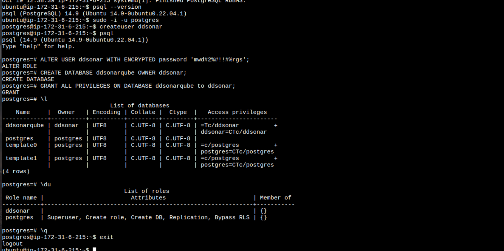
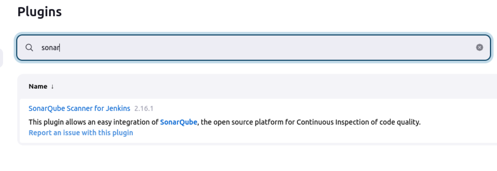
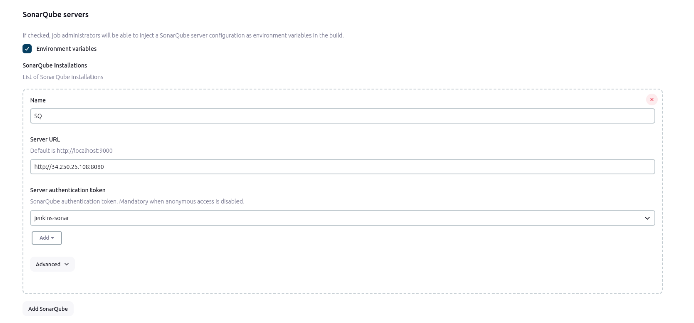

## Part 1
### 1. Configure static and dynamic agents
### Static agent
On static agent machine java JDK should be installed.
Statis node configurations in jenkins
<br></br>

Launch slave agents via Java Web Start on slave's machine
<br></br>

Node connected
<br></br>
<br></br>

Job launched successfully via static node
<br></br>

### 2. Use credentials for sensitive data (github/gitlab connactions etc.)

...

### 3. Access rights configuration. Create 3 groups (dev, qa, devops and grant them different rights)

[Role-based Authorization Strategy plugin](https://plugins.jenkins.io/role-strategy/) has been used for access rights configuration

Roles created and configured on "Manage role" screen (manage/role-strategy/)
<br></br>

Users associated with certain roles on Assign Roles page (manage/role-strategy/assign-roles)
<br></br>

## Part 2 (Multibranch)
...

## Part 3 (CI pipeline)
...
### 4. Launch static code analysis, Bugs, Vulnerabilities, Security Hotspots, Code Smells available on SonarQube server.
SonarCube server installation and configuration via [script](/home/maryna-n/Documents/EPAM/devops-7-nazarenko-maryna-1/JENKINS/ENV/sonarcube-server_env.sh) based on this [article](https://medium.com/@deshdeepakdhobi/how-to-install-and-configure-sonarqube-on-aws-ec2-ubuntu-22-04-c89a3f1c2447)

Postgre installation and db configuration
<br></br>

Eventually SonarQube docker image had been used for express launch and functionality testing.
```
$ docker run -d --name sonarqube -e SONAR_ES_BOOTSTRAP_CHECKS_DISABLE=true -p 9000:9000 sonarqube:latest
```
But at real production I would use script above for configuring free-standing SonarQube server

SonarQube scanner plugin installed and it's server configured
<br></br>
<br></br>

### 7. Push image into Docker Hub
